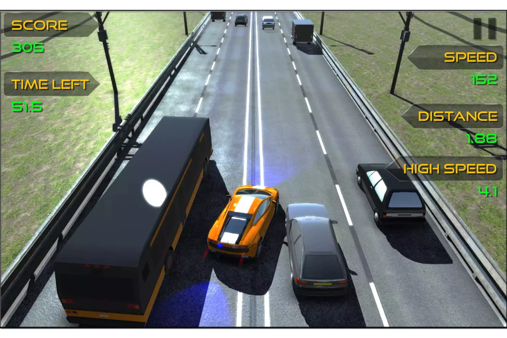
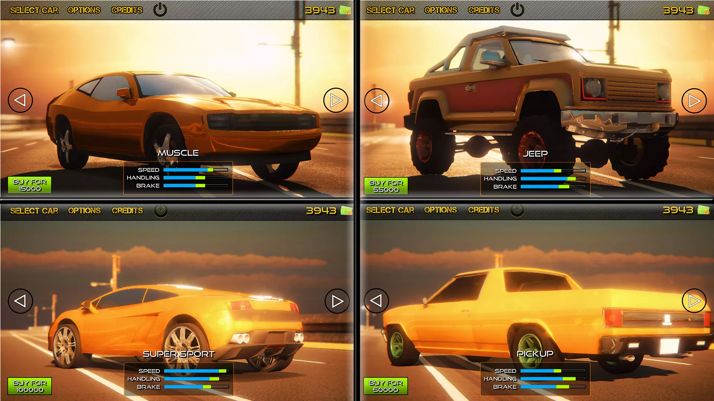
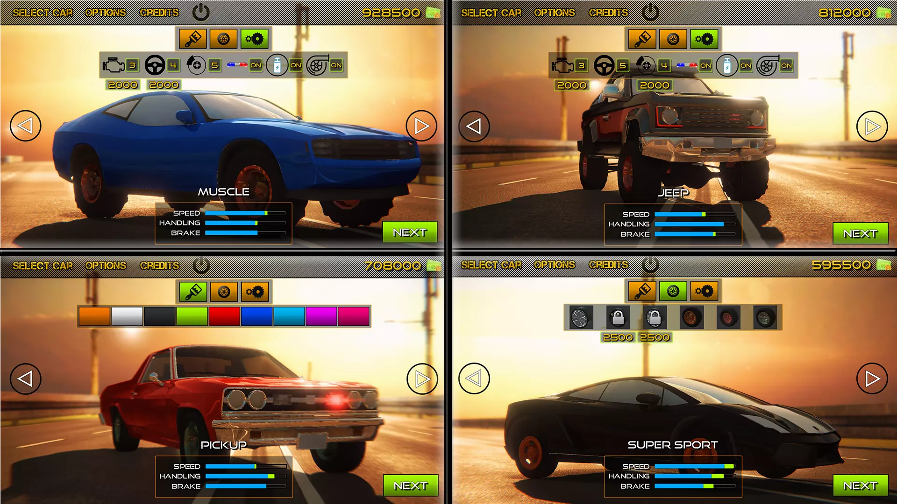
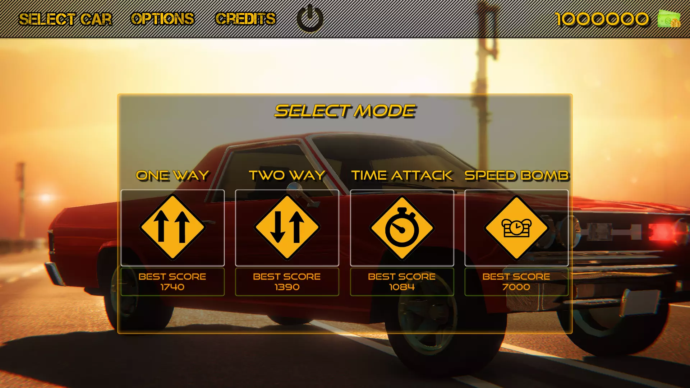
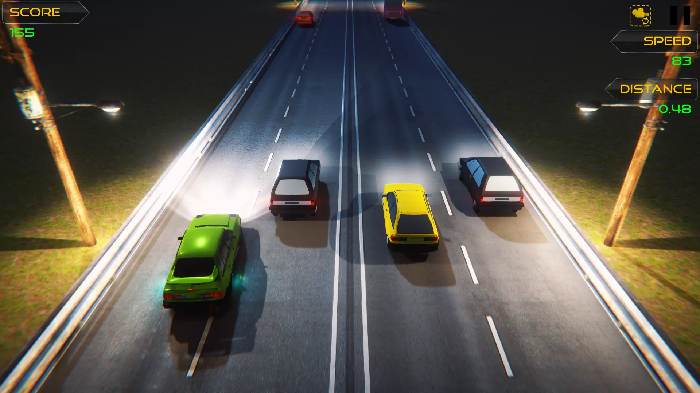
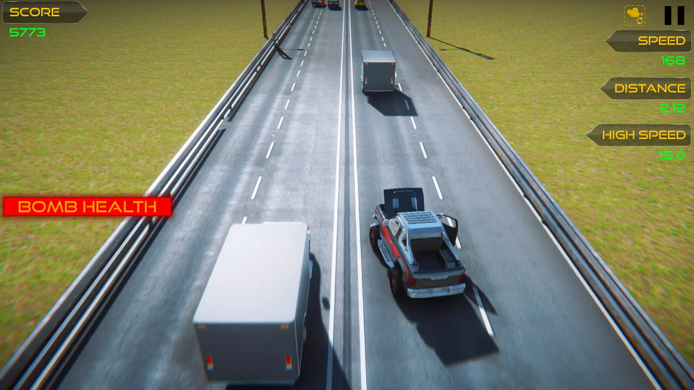
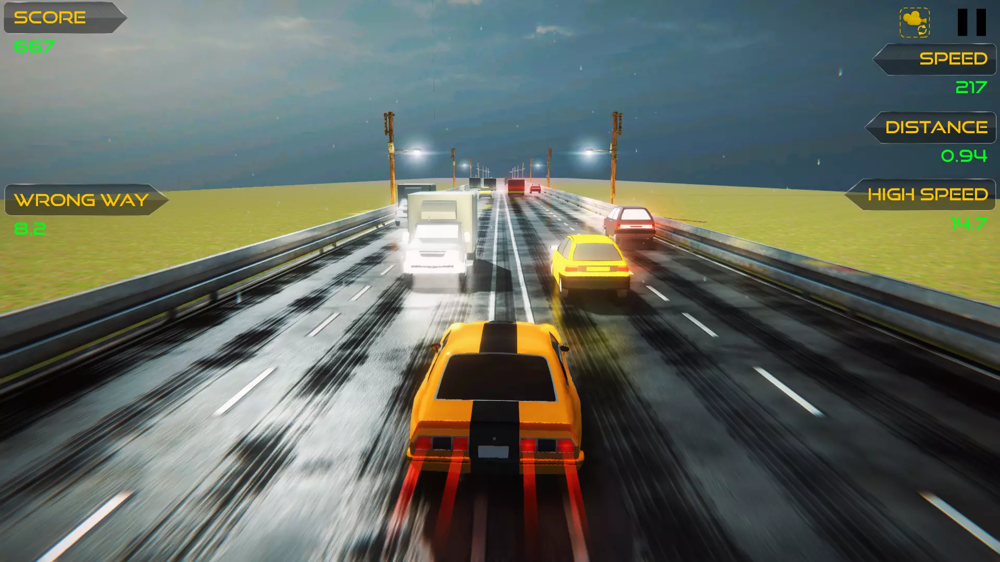
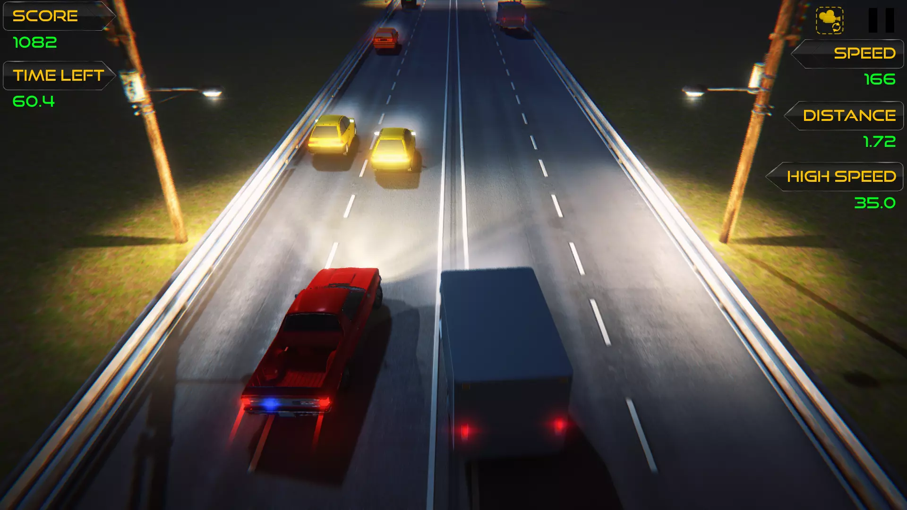
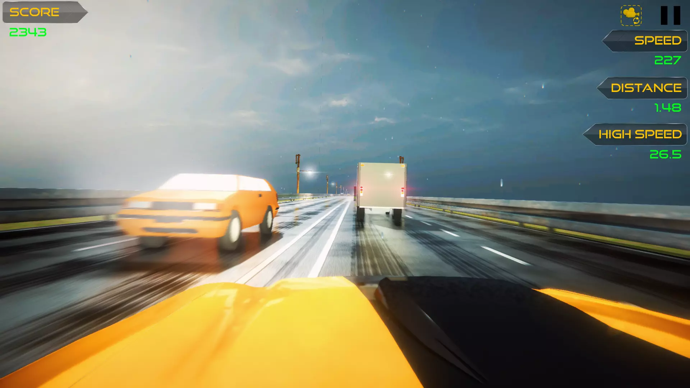
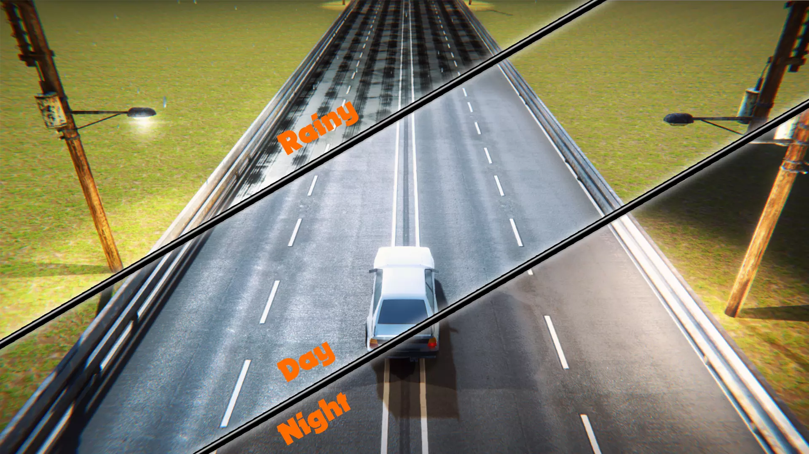

# Highway-Racer

  
  
  
  
  
  
  
  
  
  

 Highway Racer is physics based endless racing game against traffic. Dodge traffic vehicles at high speeds, earn score, buy&upgrade your rides.

 Wanna create your own endless highway racing game? Package contains all necessary assets in this one single package! All player vehicles are powered by Realistic Car Controller.

## Package Contains

  * 8 Player Vehicles,
  * 5 Traffic Vehicles,
  * 4 Levels,
  * User Friendly Editor Scripts and Editor Windows for create&use your own content,
  * All Necessary Scripts, Materials, Textures, Sound FX, etc...

## Leading Features

  * Powered by Latest Realistic Car Controller.
  * Tested and ready to deploy for PC, Mac, Linux, Android, iOS, WebGL.
  * Exciting unique game modes (including "Speed Bomb").
  * FPS, TPS and Top camera modes.
  * Pooling lightmapped roads.
  * Acceptable count of drawcalls, tris (Max DC 90, Max Tri 55k).
  * Optimized traffic cars without wheelcolliders.
  * Lane switching traffic cars.
  * Variable traffic amount.
  * Unlockable Cars.
  * Upgradable Cars (You can edit cars, prices, their upgrades from editor easily).
  * All systems are related with editor scripts.
  * Clean code, written in C#.
  * Easy to use, highly customizable.
  * All materials are compatible with [URP]. Project can be upgraded to URP easily.

## Full PDF Documentation for;

 * Creating & Configurating New Vehicles.
 * Creating & Configurating New Levels.
 * Configurating Main Menu, Options, Canvases, Score Systems, Multipliers, etc...
 * Optimization On Levels.
